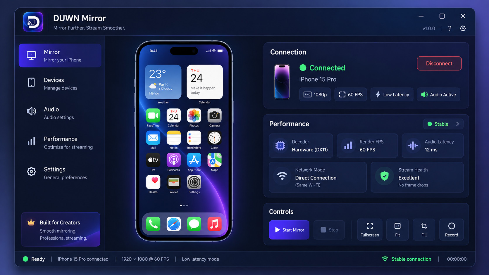

# Duwn Mirror

[Tiếng Việt](README.md) | [English](README.en.md)

[](https://github.com/leduwn/Duwn-Mirror/releases)
[](https://github.com/leduwn/Duwn-Mirror/actions)
[-blue?style=flat-square)](https://github.com/leduwn/Duwn-Mirror)
[](LICENSE)

Duwn Mirror là ứng dụng Windows hiệu năng cao dùng để **nhận, phản chiếu và truyền phát màn hình iPhone / iPad** không dây qua giao thức AirPlay tiêu chuẩn. Phần mềm được thiết kế cho người dùng cá nhân, giảng viên, lập trình viên và người sáng tạo nội dung phục vụ các nhu cầu:

- **Thuyết trình, giảng dạy & đào tạo:** Trình chiếu tài liệu, slide, thao tác trực tiếp từ iPad/iPhone lên máy tính và máy chiếu.
- **Demo & kiểm thử ứng dụng:** Trình diễn tính năng ứng dụng iOS/iPadOS trực tiếp trong các buổi họp kỹ thuật.
- **Quay video & ghi màn hình:** Thu hình chất lượng cao 1080p60 để sản xuất video hướng dẫn, đánh giá sản phẩm.
- **Livestream & truyền thông số:** Tích hợp trực tiếp vào OBS Studio, TikTok Live Studio, Discord, Teams thông qua Cửa sổ phát hoặc DirectShow Virtual Camera.
- **Giải trí & xem nội dung:** Thưởng thức ảnh, video và game di động trên màn hình lớn với âm thanh nổi sống động.



---

## 🎯 Ranh giới kỹ thuật & Cam kết bảo mật

- **Chỉ nhận luồng hiển thị (Receiver Only):** Ứng dụng chỉ nhận luồng hình ảnh và âm thanh từ thiết bị Apple sang Windows; **hoàn toàn KHÔNG can thiệp và KHÔNG điều khiển ngược lại thiết bị iOS/iPadOS**.
- **Hoàn toàn cục bộ (100% Local-First):** Hoạt động trực tiếp qua mạng Wi-Fi/LAN nội bộ. Không cần tạo tài khoản, không gửi dữ liệu ra máy chủ đám mây, không thu thập thông tin người dùng.
- **Khung hình thực (Native FPS):** Hiển thị đúng tốc độ khung hình từ nguồn phát (hỗ trợ tối đa 60 FPS), không chèn khung hình giả.
- **Âm thanh nguyên bản:** Giữ nguyên âm thanh nổi (Stereo 48 kHz PCM) không nén dải động.

---

## ✨ Tính năng nổi bật

- **Giải mã phần cứng Direct3D 11:** Tận dụng bộ giải mã Media Foundation và phần cứng GPU (NVIDIA NVDEC, Intel QuickSync, AMD AMF) để xử lý luồng H.264 với độ trễ nội bộ GPU dưới 1 mili-giây.
- **Cửa sổ phát chuyên dụng (Output Window):**
  - Tự động khóa tỉ lệ khung hình (Aspect Ratio Lock) chuẩn xác theo từng thiết bị (iPhone 19.5:9, iPad 4:3, video 16:9).
  - Tùy chọn xoay màn hình linh hoạt 0°, 90°, 180°, 270°.
  - Hỗ trợ chế độ toàn màn hình (Fullscreen) và ghim cửa sổ trên cùng (Always on Top).
- **Webcam ảo DirectShow (Virtual Camera):** Tích hợp bộ lọc DirectShow 64-bit (`duwn-virtualcam.dll`) chia sẻ trực tiếp bộ đệm texture GPU triple-buffered, cho phép OBS Studio, TikTok Live Studio, Zoom nhận diện Duwn Mirror như một webcam vật lý mà không tốn tài nguyên chụp màn hình desktop.
- **Âm thanh nổi độ trễ thấp (WASAPI):** Bộ xử lý âm thanh WASAPI độc quyền kết hợp bộ đệm vòng (ring buffer) thích ứng, loại bỏ hiện tượng giật rè âm thanh.
- **Bảng đo kiểm thời gian thực (Telemetry HUD):** Giám sát trực tiếp các thông số kỹ thuật ngay trên giao diện:
  - Tốc độ khung hình hiển thị (Render FPS) và tốc độ nguồn (Source FPS).
  - Độ trễ luồng xử lý cục bộ (Pipeline Latency).
  - Khung hình trễ / bắt kịp (Dropped & Catch-up frames).
  - Trạng thái phần cứng giải mã (D3D11 / MF Video Decoder).

---

## 📥 Tải về & Cài đặt

Truy cập [Trang phát hành chính thức (GitHub Releases)](https://github.com/leduwn/Duwn-Mirror/releases/latest) để tải phiên bản mới nhất:

| Gói cài đặt | Dung lượng | Đối tượng & Mục đích sử dụng |
| :--- | :--- | :--- |
| **`Duwn-Mirror-Setup-1.1.1-x64.exe`** (Khuyên dùng) | ~79 MB | **Trọn gói (Bootstrapper):** Tự động phát hiện và cài đặt Microsoft Visual C++ 2015-2026 Redistributable (x64), tự động mở cổng Windows Firewall. |
| **`Duwn-Mirror-1.1.1-x64.msi`** | ~61 MB | **Windows Installer tiêu chuẩn:** Phù hợp quản trị viên IT, triển khai tự động qua GPO/SCCM, hoặc máy tính đã có sẵn VC++ runtime. Đã tích hợp mở cổng Firewall tự động. |
| **`SHA256SUMS.txt`** | < 1 KB | Bảng mã băm SHA-256 đối chiếu tính toàn vẹn của các tệp tin phát hành. |

### 🛡️ Lưu ý về cảnh báo Windows SmartScreen

Vì Duwn Mirror là dự án mã nguồn mở phi thương mại phát hành miễn phí từ cộng đồng, các gói cài đặt chưa được ký bằng chứng chỉ số doanh nghiệp có phí (EV Code Signing). Khi cài đặt, Windows Defender SmartScreen có thể hiển thị cảnh báo:

> *"Windows protected your PC / Windows đã bảo vệ PC của bạn"*

**Cách tiếp tục cài đặt an toàn:**

1. Bấm vào dòng chữ **"More info"** *(Thông tin khác)* trên hộp thoại cảnh báo.
2. Bấm nút **"Run anyway"** *(Vẫn chạy)* để tiến hành cài đặt.
3. Bạn có thể kiểm tra mã băm SHA-256 của tệp tải về với bảng mã trong `SHA256SUMS.txt` để đảm bảo tệp nguyên gốc từ dự án.

---

## 💻 Yêu cầu hệ thống

- **Hệ điều hành:** Windows 10 (bản 22H2 trở lên) hoặc Windows 11 (64-bit).
- **Phần cứng GPU:** Card đồ họa hỗ trợ DirectX 11 và giải mã phần cứng H.264 (NVIDIA GeForce GTX 600 series trở lên, Intel HD Graphics 4000 series trở lên, AMD Radeon HD 7000 series trở lên).
- **Mạng cục bộ:** Cả máy tính Windows và iPhone/iPad cùng kết nối vào một mạng Wi-Fi/LAN. Khuyến nghị sử dụng băng tần **Wi-Fi 5 GHz** hoặc cắm dây LAN cho máy tính để đảm bảo độ trễ thấp nhất và không suy hao gói tin.
- **Thiết bị nguồn:** iPhone hoặc iPad chạy iOS 12.0 trở lên có tính năng **Phản chiếu màn hình (Screen Mirroring)** trong Trung tâm điều khiển.

---

## 🚀 Hướng dẫn sử dụng nhanh

1. **Mở ứng dụng:** Khởi chạy `Duwn Mirror` từ Start Menu hoặc màn hình Desktop.
2. **Kiểm tra trạng thái:** Bảng điều khiển ứng dụng sẽ hiển thị trạng thái máy chủ thu AirPlay đang hoạt động và sẵn sàng kết nối.
3. **Kết nối từ iPhone / iPad:**
   - Vuốt mở **Trung tâm điều khiển (Control Center)** trên thiết bị iOS.
   - Chạm vào biểu tượng **Phản chiếu màn hình** *(Screen Mirroring)*.
   - Chọn tên thiết bị: **`Duwn Mirror [Tên-Máy-Tính]`**.
4. **Trải nghiệm:** Màn hình thiết bị và âm thanh sẽ ngay lập tức được phát trên cửa sổ Windows.

---

## 🎥 Tích hợp Livestream (OBS Studio & TikTok Live Studio)

Duwn Mirror cung cấp 2 phương thức kết nối chuyên nghiệp để đưa luồng hình ảnh vào phần mềm phát sóng:

### Cách 1: Sử dụng Webcam ảo (DirectShow Virtual Camera) — Khuyên dùng

1. Trên bảng điều khiển Duwn Mirror, bật tính năng **"Webcam ảo"** (Virtual Camera).
2. Mở OBS Studio hoặc TikTok Live Studio.
3. Thêm nguồn: chọn **Video Capture Device** *(Thiết bị ghi hình)*.
4. Chọn thiết bị tên: **`Duwn Mirror Video`**.
5. Hình ảnh truyền trực tiếp qua bộ đệm phần cứng Direct3D 11, đảm bảo chất lượng hình ảnh sắc nét mà không bị gián đoạn khi bạn thu nhỏ hoặc che khuất cửa sổ ứng dụng.

### Cách 2: Bắt cửa sổ hiển thị (Window Capture)

1. Trong OBS Studio, bấm `+` tại bảng Sources -> chọn **Window Capture** *(Quay cửa sổ)*.
2. Tại mục Window, chọn: `[duwn-mirror.exe]: Cửa sổ phát`.
3. Phương thức quay: Chọn **Windows 10 (1903 trở lên)** để bắt hình tăng tốc phần cứng mượt mà.

### Thiết lập âm thanh

- Duwn Mirror phát âm thanh trực tiếp đến thiết bị âm thanh mặc định của Windows qua WASAPI.
- Trong OBS Studio, âm thanh sẽ tự động được thu qua nguồn **Desktop Audio** *(Âm thanh máy tính)* hoặc nguồn **Application Audio Capture** *(Bắt âm thanh ứng dụng)* nếu bạn muốn tách luồng âm thanh riêng biệt.

---

## 🔧 Khắc phục sự cố thường gặp (Troubleshooting)

### 1. iPhone/iPad không tìm thấy máy tính trong danh sách Screen Mirroring

- **Tường lửa (Firewall):** Đảm bảo Windows Firewall không chặn ứng dụng. Duwn Mirror cần các cổng mạng:
  - TCP: `5000–5010`, `7000–7010`, `7100` (Điều khiển AirPlay & RTSP)
  - UDP: `6000–6010`, `7011` (Luồng truyền dữ liệu hình ảnh & âm thanh RTP/mDNS)
- **Tính năng Client Isolation trên Router:** Một số router Wi-Fi bật tính năng cách ly thiết bị khách (AP/Client Isolation), khiến các máy trong cùng mạng Wi-Fi không nhìn thấy nhau. Vui lòng tắt tính năng này trong cài đặt bộ định tuyến.
- **Khác mạng Wi-Fi:** Đảm bảo điện thoại và máy tính không kết nối vào hai mạng khác nhau (ví dụ: một máy dùng mạng Khách - Guest Network, một máy dùng mạng Chính).

### 2. Màn hình đen hoặc xuất hiện hiện tượng giật khung hình

- **Băng tần Wi-Fi:** Mạng Wi-Fi 2.4 GHz rất dễ bị nhiễu sóng hoặc suy hao băng thông khi truyền video 1080p60. Hãy chuyển thiết bị sang băng tần Wi-Fi 5 GHz.
- **Cập nhật Driver card đồ họa:** Đảm bảo driver card màn hình (NVIDIA, Intel, AMD) trên máy tính đã được cập nhật phiên bản mới nhất hỗ trợ D3D11 Video Decoding.

---

## 🛠️ Biên dịch từ mã nguồn (Building from Source)

### Yêu cầu công cụ

- **Hệ điều hành:** Windows 10/11 x64.
- **Trình biên dịch:** Visual Studio 2022 (với gói tải *Desktop development with C++*).
- **Công cụ xây dựng:** CMake 3.25 trở lên.
- **Đóng gói installer (tùy chọn):** WiX Toolset v5 và .NET SDK.

### Các bước thực hiện

```powershell
# 1. Sao chép kho mã nguồn
git clone https://github.com/leduwn/Duwn-Mirror.git
cd Duwn-Mirror

# 2. Cấu hình dự án bằng CMake
cmake --preset release

# 3. Biên dịch bản phát hành
cmake --build build/release --config Release

# 4. Chạy kiểm thử tự động (Unit Tests)
ctest --test-dir build/release --output-on-failure -C Release

# 5. Đóng gói bộ cài đặt WiX (Tùy chọn)
powershell -ExecutionPolicy Bypass -File installer/build-installer.ps1 -Configuration Release
```

---

## 📄 Bản quyền & Tuyên bố pháp lý

- **Bản quyền mã nguồn:** Dự án Duwn Mirror được kế thừa và phát triển từ các thành phần mã nguồn mở (bao gồm UxPlay, GPLv3) và được phân phối theo giấy phép [GNU General Public License v3.0](LICENSE).
- **Tuyên bố thương hiệu:** Apple, iPhone, iPad, iOS, iPadOS, AirPlay và Bonjour là các nhãn hiệu đã đăng ký của Apple Inc. tại Hoa Kỳ và các quốc gia khác. Dự án Duwn Mirror là một phần mềm độc lập, không được tài trợ, ủy quyền hoặc liên kết trực tiếp với Apple Inc.
